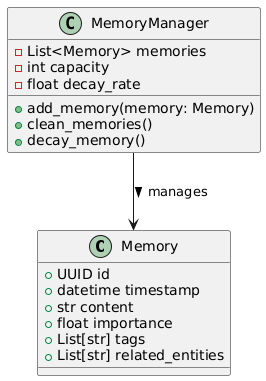
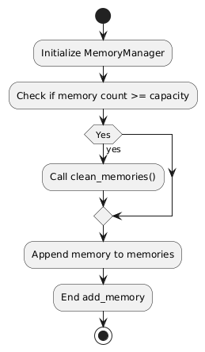
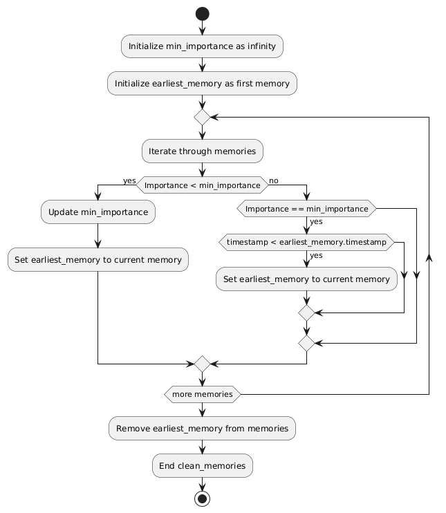
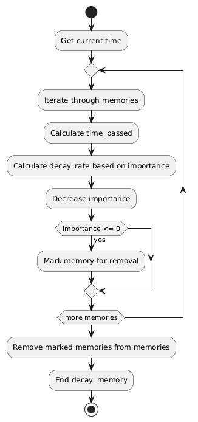

# Architecture diagrams and flowchart

This document provides diagrams for the architecture and working of the application

## Flowchart for `generate_response`

## Class diagram for `Memory`

### Flowchart for `add_memory`

### Flowchart for `clean_memory`

### Flowchart for `decay_memory`

